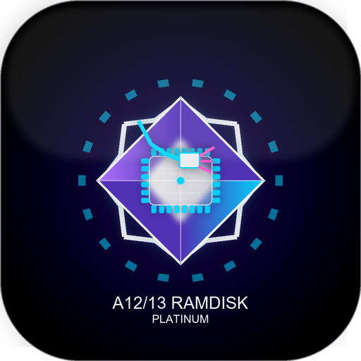
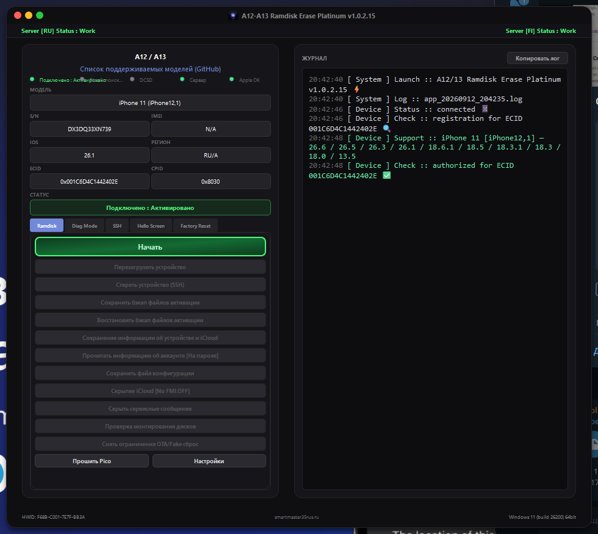
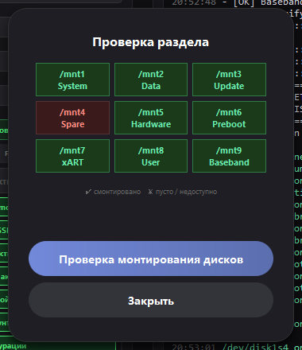
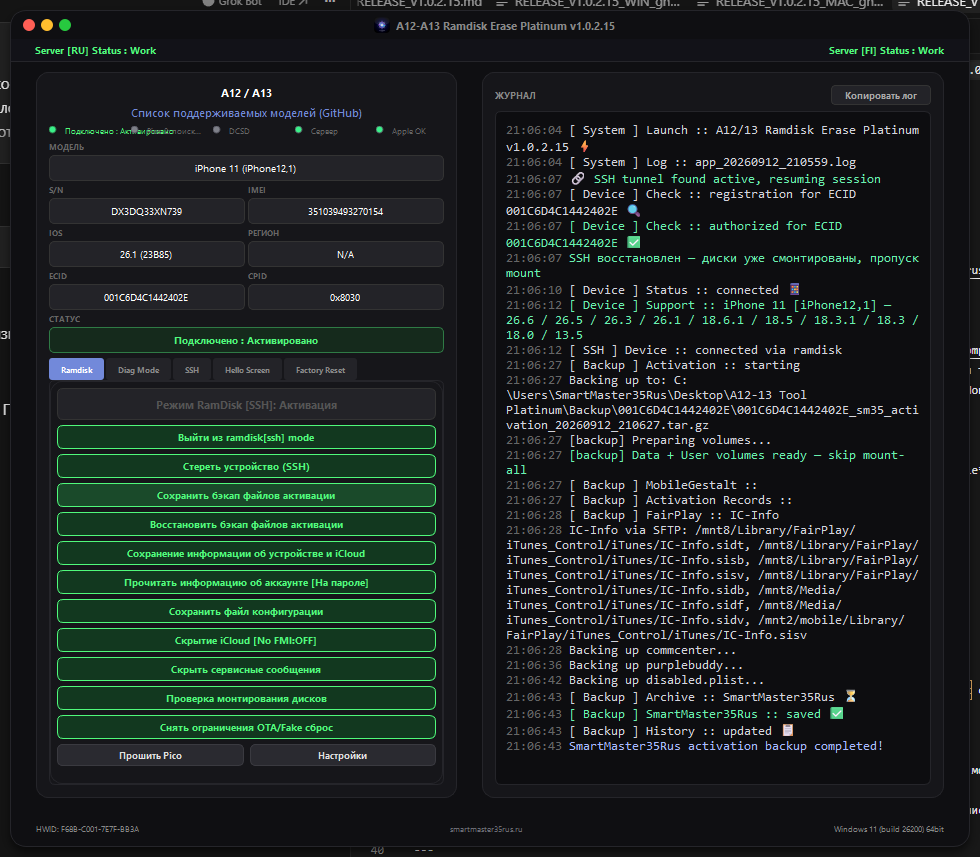
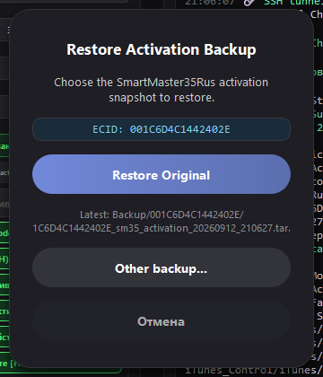

# A12 / A13 Ramdisk Erase Platinum

**Professional ramdisk toolkit for Apple A12–A13 devices on macOS**

[⬇️ Download latest release](https://github.com/smartmaster35rus-dev/A12-13-Ramdisk-Erase-tool-Platinum-mac/releases/latest) · [📋 Supported models](https://github.com/smartmaster35rus-dev/ramdisk-A12-13) · [🌐 Activator site](https://smartmaster35rus-activator.ru/)

---

## 🇷🇺 О программе

**A12/13 Ramdisk Erase Platinum** — десктопный инструмент для работы с iPhone/iPad на чипах **Apple A12 и A13** через SSH ramdisk: загрузка, монтирование разделов, чтение конфигурации, бэкап/восстановление activation, erase, Hello Screen, Diag Mode и многое другое.

Platinum UI: тёмная тема, live-журнал, статусы сервера RU/FI и Apple Seed, ECID-регистрация. На macOS — bundled `irecovery`, `7zz`, `usbliter8_boot`, без Homebrew.

## 🇬🇧 About

**A12/13 Ramdisk Erase Platinum** is a macOS desktop toolkit for **Apple A12 & A13** devices over SSH ramdisk: boot, partition mount, device info, activation backup/restore, erase, Hello Screen bypass, Diag Mode, and more.

Platinum UI: dark theme, live log, RU/FI server + Apple Seed health, ECID registration. On macOS — bundled `irecovery`, `7zz`, `usbliter8_boot`, no Homebrew required.

---

## 📸 Screenshots

> Единый Platinum UI на Windows и macOS — те же экраны и workflow.

| Device connected | SSH ramdisk session |
|:---:|:---:|
|  |  |

| iOS support list | Mount partition check |
|:---:|:---:|
|  |  |

| Activation backup | Restore snapshot |
|:---:|:---:|
|  |  |

---

## ✨ Key features

| Feature | Description |
|---------|-------------|
| 🚀 **Ramdisk boot** | PwnedDFU → iBSS/iBEC → kernel → SSH ramdisk (bundled macOS tools) |
| 📦 **Auto mount** | Full APFS mount (`/mnt1`–`/mnt9`) + mount checker UI |
| 📱 **Device info** | Model, SN, IMEI, iOS, ECID, CPID — auto-read after mount |
| 💾 **SM35 backup** | Activation snapshot: `sisv`, `record`, `data_ark`, gestalt, FairPlay |
| 🔄 **Restore** | One-click restore original / pick another backup |
| 🗑️ **Factory erase** | SSH nvram oblit + auto reboot |
| 👋 **Hello Screen** | Bypass workflows, iCloud hide, service message hide |
| 🔧 **Diag Mode** | SysCFG read/write via DCSD serial |
| 🌐 **Online** | Ramdisk from GitHub Releases, server health, site model API |
| 🍎 **macOS native** | DMG installer, bundled `7zz` / `irecovery`, Pico UF2 flash, smart ramdisk cache |
| 🌍 **i18n** | Russian · English · Spanish |

---

## ⬇️ Download

Go to **[Releases](https://github.com/smartmaster35rus-dev/A12-13-Ramdisk-Erase-tool-Platinum-mac/releases/latest)** and download:

| File | Purpose |
|------|---------|
| `A12_13_Ramdisk_Tool_installer.dmg` | macOS app bundle (drag to Applications) |

> ⚠️ On first launch: **right-click → Open** if Gatekeeper blocks the app. Requires **Pico 2** with usbliter8 firmware.

---

## 🚀 Quick start (macOS)

1. Open **A12-A13 Ramdisk Erase Platinum** from Applications
2. Connect **Pico 2** and put the device in **DFU**
3. Click **Start** → wait for **PwnedDFU**
4. Pick iOS version → **Boot Ramdisk**
5. After boot: SSH via Terminal — `ssh root@localhost -p 1337` (password: `alpine`)

---

## 📋 Requirements

- **OS:** macOS 11 Big Sur or newer (Intel; Apple Silicon via Rosetta if applicable)
- **USB:** quality cable, trust the Mac when prompted
- **Hardware:** Raspberry Pi Pico 2 with usbliter8 (UF2 flash via `/Volumes/*/INFO_UF2.TXT`)
- **Devices:** iPhone XS / XR / 11 series, SE 2, iPad 8th/9th gen — see [ramdisk catalog](https://github.com/smartmaster35rus-dev/ramdisk-A12-13/releases)
- **Network:** internet for ramdisk download, ECID check, server features (offline index bundled)
- **Diag:** DCSD cable for SysCFG read/write

### Supported devices

| Chip | Models |
|------|--------|
| **A12** | iPhone XR, XS, XS Max · iPad mini 5 · iPad Air 3 · iPad 8 |
| **A13** | iPhone 11, 11 Pro, 11 Pro Max · SE (2nd gen) · iPad 9 |

---

## 🔗 Related links

| Resource | URL |
|----------|-----|
| Ramdisk images | [smartmaster35rus-dev/ramdisk-A12-13](https://github.com/smartmaster35rus-dev/ramdisk-A12-13) |
| Activator / support | [smartmaster35rus-activator.ru](https://smartmaster35rus-activator.ru/) |
| Windows build | [A12-13-Ramdisk-Erase-tool-Platinum-win](https://github.com/smartmaster35rus-dev/A12-13-Ramdisk-Erase-tool-Platinum-win/releases) |

---

## 📝 Changelog

See [Releases](https://github.com/smartmaster35rus-dev/A12-13-Ramdisk-Erase-tool-Platinum-mac/releases) for full notes.

**v1.0.2.16** — auto device info after mount, startup fixes, server boot logos, README redesign  
**v1.0.2.15** — GitHub ramdisk migration, site labels, bundled 7zz, smart cache  

---

## ⚖️ Disclaimer

This tool is intended for **authorized service and research** on devices you own or are permitted to work on. The author is not responsible for misuse.

---

**SmartMaster35Rus** · [smartmaster35rus.ru](https://smartmaster35rus-activator.ru/) · [Telegram](https://t.me/smartmaster35rus)

